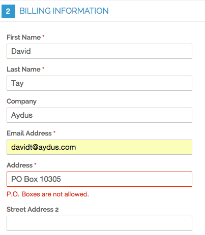

Disallow PO Box
===============

Disallow PO Boxes in billing and/or shipping addresses.

How to use
----------

To disable PO Boxes in billing addresses, go to the admin in 
System -> Configuration -> Customers -> Customer Configuration -> Name and Address Options, 
and set Disallow PO Boxes in Billing Address to Yes:

To disable PO Boxes in shipping addresses, go to the admin in 
System -> Configuration -> Sales -> Shipping Settings -> Options, 
and set Disallow PO Boxes in Shipping Address to Yes:

On the front end:

